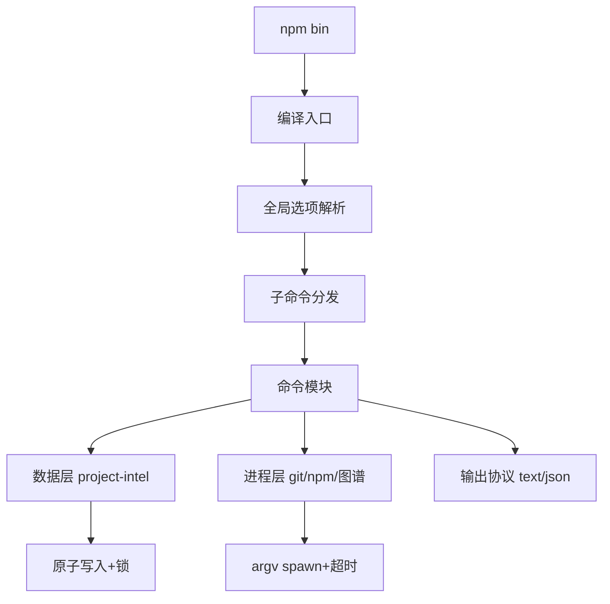

# LOCAL-20260721-144445_Project Intelligence Node.js/TypeScript 运行时迁移_设计文档

**江苏电信BSS项目**

**Project Intelligence Node.js/TypeScript 运行时迁移**

**2026年07月**

**文档更改记录**

| **版本** | **日期** | **描述** | **修改人** |
|---|---|---|---|
| 0.1 | 2026-07-21 | 初稿，覆盖渐进式迁移五阶段、TS 工程骨架与兼容合同 | xumeng |

# 需求/问题概述

## 需求描述

Project Intelligence 当前以 npm 包形式交付，已将 CLI、项目扫描、需求生命周期、测试证据、评审收口、适配器和文档处理迁移到 `src/` 下的 TypeScript/Node.js 实现，并通过 `bin/project-intel.mjs` 直接加载编译产物。这避免 npm 包继续要求用户安装 Python 运行时，规避 Windows 上 `python3` 缺失和非 UTF-8 控制台导致的命令失败，也避免生成物默认依赖 Python 质量命令。本需求采用渐进式等价迁移，最终发布包仅依赖 Node.js 18+，TypeScript 作为开发语言在发布时编译为 JavaScript，保持现有 CLI 命令、参数、帮助、退出码、JSON 输出协议、`.project-intel` 数据格式和 GitNexus/Understand-Anything/Skill/插件集成行为兼容，不新增业务命令或数据模型。

## 需求提出部门及联系人

Project Intelligence 开源项目维护者；联系人 xumeng。

## 电信需求负责人

xumeng

## 需求适用范围

Project Intelligence npm 包 `project-intelligence` 0.6.1 及以上版本的发布实现、CLI、项目事实层、需求生命周期、适配器、Git Hook、CI 与发布流程。

## 需求期望完成时间

按迁移五阶段分批交付，阶段 1（行为基线与 TS 骨架）在第一个迭代内完成，后续阶段以模块迁移进度为准。

# 设计相关选项

| 任务类型 | 需求 | 需求协调人 | xumeng |
|---|---|---|---|
| 设计负责人 | xumeng | 涉及中心 | Project Intelligence CLI 与发布链路 |
| 评审模式 | 组内 | 模型变动 | 不涉及 |
| 代码走查 | 涉及 | 接口变动 | 不涉及 |
| 界面变动 | 不涉及 | 是否联调 | 否 |

# 场景分析

## 场景分析

### 场景一：仅装 Node.js 的新用户安装与初始化

- 场景名称：Node-only 环境安装与首启
- 参与对象：终端用户、npm、`project-intel` CLI、`.project-intel/`
- 前置条件：用户设备仅安装 Node.js 18+，PATH 中不存在 Python；已通过 `npm install -g project-intelligence` 完成全局安装。
- 处理过程：用户执行 `project-intel --version`、`project-intel doctor --json`、`project-intel init --dry-run --no-graph`；Node.js 入口直接定位包内编译产物，不探测 Python、不 spawn 子进程；版本来自单一版本源；doctor 报告运行时为 Node.js 且不提示 Python 缺失；init 预览生成与基线等价的 `.project-intel` 结构摘要。
- 目标结果：三条命令均返回退出码 0，JSON 模式下顶层字段与基线一致，标准输出为 UTF-8。
- 异常边界：Node 版本低于 18 时 doctor 显式报错并给出升级建议；包内产物缺失时退出码非 0 且错误信息可诊断，不静默回退到 Python。

### 场景二：0.6.1 项目原地升级

- 场景名称：已有 `.project-intel` 数据的升级
- 参与对象：升级用户、新版本 CLI、既有 `.project-intel/` 数据夹具
- 前置条件：用户已用 0.6.1 维护 `.project-intel`，包含配置、项目事实、需求生命周期、测试证据、评审结果和维护记录。
- 处理过程：新版本读取现有 config.json（schemaVersion 2）、manifest.json、knowledge 目录、standards 目录、requirements 状态机文件；不提升 schema 版本、不写入旧版本无法忽略的字段；执行查询、需求状态推进和刷新后，文件结构保持可被 0.6.1 回滚读取。
- 目标结果：升级前后无未授权数据丢失或 schema 变化，0.6.1 可继续读取新版本写入的兼容 schema 数据。
- 异常边界：遇到损坏 JSON 时保留原文件并报错，不半写覆盖；执行失败不留下损坏的 JSON、YAML、Markdown 或锁文件。

### 场景三：跨平台一致性

- 场景名称：Windows/macOS/Linux 同行为
- 参与对象：三平台 CI、中文项目路径、带空格路径、非 UTF-8 控制台
- 前置条件：同一仓库在三平台运行同一命令。
- 处理过程：CLI 以显式 UTF-8 处理标准输出、标准错误和文件 I/O；相对路径以显式项目根为基准；外部进程用 argv 数组 + 显式工作目录 + 超时调用；Git Hook 与检测到的质量命令不引用 `python3`。
- 目标结果：除绝对路径和平台固有信息外，结构化结果、文件内容、排序、错误类型和退出码一致。
- 异常边界：工具不存在映射为退出码 127，超时映射为 124，用法错误映射为 2，运行错误映射为 1，与基线退出码合同一致。

### 场景四：需求全生命周期

- 场景名称：init→intake→spec→ready→begin→test→review→finish→maintain
- 参与对象：用户、CLI、需求状态机、`.project-intel/requirements/<id>/`、测试证据
- 前置条件：项目已初始化，需求文档与 AC 已就绪。
- 处理过程：新实现复用现有状态机（created/amended/accepted/ready/begun/tested/reviewed/finished/closed）和门禁；test 阶段执行受支持测试报告或可验证命令；review 记录评审结果；finish 在门禁未满足时拒绝通过。
- 目标结果：主流程与诊断、延期、重开、修订、发现项处理分支均保持现有状态门禁和失败原因。
- 异常边界：仅含伪造通过文本但无受支持测试报告的证据不得被判定为成功；故意制造失败时 test/review/finish 必须拒绝。

### 场景五：开发与发布

- 场景名称：Node-only 发布与冒烟
- 参与对象：维护者、npm、CI、`npm pack` 产物、干净临时目录
- 前置条件：TypeScript 源码编译为 JavaScript 产物，包内含必要资源。
- 处理过程：维护者运行类型检查、单元测试、跨平台测试、构建、打包和发布校验；`npm pack` 产物在干净临时目录安装并执行核心流程冒烟；测试期间监测子进程，确认未查找、启动或动态导入 Python，运行时不读取包外仓库源码。
- 目标结果：发布校验在版本不一致时失败；`--version`、`doctor --json`、`package.json`、打包产物报告同一版本。
- 异常边界：版本不一致、包内残留 Python 引用、包外源码引用均阻断发布。

## 风险考虑

迁移期间存在双实现漂移、CLI 兼容性回归、Windows 编码与路径、数据 schema 误升级、外部进程行为差异、测试覆盖缺口与发布版本源分散七类风险。迁移期间允许内部桥接旧实现，但每个桥接点必须可被测试识别并有对应移除条件；正式发布验收会扫描 Python 进程调用和运行时文件引用。

紧急方案：

若某模块迁移后发现严重不兼容，先在该命令路径上保留 Python 桥接并标注移除条件，通过双实现对照测试定位差异，修复后切回 Node 实现；若发布前发现 schema 误升级，立即回退 schema 版本并通过 0.6.1 回滚读取验证；若发布版本源不一致，`scripts/check-release.mjs` 必须阻断发布。

# 实现方案

### TypeScript 工程骨架与构建链路

- 改造目的：建立可在发布时编译为 JavaScript 的 TypeScript 源码基线，取代 `bin/project-intel.mjs` 直接 spawn Python 的启动方式。
- 当前与目标：现状为 bin 启动器通过 spawnSync 依次尝试 `py -3`/`python3`/`python` 拉起 Python 门面；目标为 Node 入口直接加载编译产物，Python 门面仅作迁移期对照基线。
- 处理规则：新增 `src/` 目录承载 TypeScript 源码，编译输出到 `dist/`；`bin` 启动器改为指向编译产物；TypeScript 编译器列为 devDependency；npm 包 files 字段收录 `dist` 与必要资源；Python 源码在迁移期保留，移除时间以生产运行路径不再引用为准。
- 字段流转：`package.json` → Node 解析 → 编译入口 → 应用调度器 → 各命令模块。
- 调用顺序：npm bin → 编译入口 → 全局选项解析（`--project`/`--version`/`--json`）→ 子命令分发 → 命令模块 → 数据层/进程层 → 输出协议。
- 异常与兼容：编译产物缺失时退出码非 0 且错误信息可诊断；Node 版本低于 18 时 doctor 显式报错。
- 源码依据：`bin/project-intel.mjs`（Node 启动器）、`src/cli.ts#registry`（命令注册表）

### CLI 与输出协议移植

- 改造目的：用 TypeScript 重写 argparse 子命令分发与 JSON 信封，保持命令名、参数、默认值、互斥关系、帮助、退出码和 JSON 顶层字段兼容。
- 当前与目标：现状为 `JsonArgumentParser` 覆盖 `error()` 退出码 2，`json_envelope` 产出 `{ok, command, status, exitCode, error, result, output}`；目标为 TypeScript 等价实现，错误文本经同样的脱敏（bearer/cookie/secret/URL userinfo）处理。
- 处理规则：`--json` 作为全局选项在子命令前出现并被剥离；退出码合同为 0/1/2/124/127；帮助文本以 0.6.1 快照为基线逐命令对照。
- 字段流转：

| 字段 | 含义 | 来源/规则 |
| --- | --- | --- |
| ok | 命令是否成功 | 退出码 0 为 true |
| command | 子命令名 | 分发时记录 |
| status | 状态分类 | USAGE_ERROR/COMMAND_FAILED 等 |
| exitCode | 退出码 | 0/1/2/124/127 |
| error | 脱敏后错误文本 | `_sanitize_error_text` 规则 |
| result | 结构化结果 | 命令产出 |
| output | 捕获的标准输出 | 仅 `--json` 模式 |

- 调用顺序：入口 → 全局选项剥离 → argparse 等价解析 → 命令执行 → stdout/stderr 重定向（JSON 模式）→ 信封封装。
- 异常与兼容：用法错误统一退出码 2；运行错误统一退出码 1；外部工具缺失 127；超时 124。
- 源码依据：`src/cli.ts#registry`、`src/cli/json-envelope.ts`

### 数据层与原子写入移植

- 改造目的：在 Node.js 中复刻 `.project-intel` 读写、原子替换、文件锁和 UTF-8 规则，保证已有数据原地可读、失败不半写。
- 当前与目标：现状为 `write_json`/`write_text` 使用 `tempfile.mkstemp` + `fsync` + `os.replace`，`_RequirementLock` 用 `os.O_CREAT|os.O_EXCL` 创建锁文件并带 60s 陈旧锁回收；目标为 Node 等价实现，锁文件路径保持在需求目录父级以兼容 Windows 移动语义。
- 处理规则：所有 JSON/YAML/Markdown 默认 UTF-8；原子写经临时文件 + `fs.rename`/`os.replace` 等价；锁超时 5s、陈旧阈值 60s；Git NUL 分隔输出按 `\0` 切分而非换行。
- 字段流转：内存对象 → `JSON.stringify(ensure_ascii=false)` 等价 → UTF-8 Buffer → 临时文件 → 原子替换。
- 调用顺序：校验 → 序列化 → 临时文件写入 + fsync → 原子替换 → 锁释放。
- 异常与兼容：失败保留原始有效数据，不静默覆盖；权限错误可诊断。
- 源码依据：`src/fs/atomic-write.ts#writeJson`、`src/requirements/state-machine.ts#mutate`

### 外部进程与跨平台子进程层

- 改造目的：统一 Git/npm/GitNexus/Understand-Anything/质量命令的调用方式，消除 `shell=True` 与 `python3` 硬编码。
- 当前与目标：现状为 `run`（argv 形）和 `run_shell`（`shell=True`）并存，质量检测对 Python 项目输出 `python3 -m pytest/ruff/mypy`，Git Hook 体硬编码 `python3 "$SCRIPT"`；目标为统一 argv 形 `spawn`，工具不存在映射 127、超时映射 124，输出强制 UTF-8 解码。
- 处理规则：质量命令改为 `npx`/平台无关调用；Git Hook 体改为调用 npm 包提供的 Node CLI；Windows 上通过 `process.platform` 探测并用 `cmd /c` 等价方式处理 `.cmd`/`.bat`。
- 字段流转：命令数组 → `child_process.spawn`（cwd/env/timeout）→ 退出码 + stdout + stderr → 脱敏 + 截断。
- 调用顺序：`command_exists` 等价（`shutil.which` + PATHEXT）→ argv spawn → 超时/错误映射 → 结果回填。
- 异常与兼容：`FileNotFoundError` → 127；`TimeoutExpired` → 124；非零退出码透传。
- 源码依据：`src/process/spawn.ts#run`、`src/scanner/quality.ts`、`src/commands/hooks.ts#hookScriptBody`

### 版本源统一与发布校验

- 改造目的：消除 `VERSION`、`package.json`、claude 插件清单、codex 插件清单四处版本分散，统一为单一版本源并自动生成其余。
- 当前与目标：现状为四处独立硬编码 `0.6.1`，由 `scripts/check-release.mjs` 正则比对；目标为以 `package.json` 为单一源，构建时生成版本产物和插件清单版本字段，`scripts/check-release.mjs` 校验一致性。
- 处理规则：`--version`、`doctor --json`、npm 元数据、打包产物均读同一源；版本不一致时发布校验失败。
- 字段流转：`package.json` → 构建脚本 → 版本产物 + 插件清单 → 运行时读取。
- 调用顺序：构建 → 生成版本产物 → 发布校验 → 打包。
- 异常与兼容：版本不一致阻断发布；manifest.json 的 toolVersion 为独立遗留字段，不与发布版本耦合。
- 源码依据：`src/version.ts#VERSION`、`package.json`、`plugins/project-intelligence/.claude-plugin/plugin.json`

### 迁移阶段与双实现对照

- 改造目的：按需求 5.2 节五阶段推进，建立可重复执行的双实现对照测试，逐模块切换到 Node 实现。
- 当前与目标：现状为单一 Python 实现；目标为阶段 1 冻结 CLI 快照与输出协议并建对照工具，阶段 2 迁移基础设施（CLI/配置/文件系统/进程/输出/锁/文档），阶段 3 按扫描→需求生命周期→测试证据→评审收口→适配器→图谱集成顺序迁移业务模块，阶段 4 移除生产桥接，阶段 5 干净环境安装与三平台验收。
- 处理规则：每个桥接点可被测试识别并有移除条件；Python 测试逐项映射为 Node 测试，不得无说明删除覆盖行为；正式发布包不得以 Python 为运行依赖或回退路径。
- 字段流转：Python 测试用例 → 映射清单 → Node 等价测试 → 覆盖率报告。
- 调用顺序：冻结基线 → 基础设施迁移 → 业务模块逐项迁移 → 桥接移除 → 发布验收。
- 异常与兼容：迁移期保留 Python 旧实现用于对照；未获批准的测试删除/跳过/弱化导致验收失败。
- 源码依据：`src/requirements/state-machine.ts#setTestContract`、`src/requirements/state-machine.ts#recordDiagnosis`、`src/requirements/state-machine.ts#recordReview`、`src/requirements/documents.ts`、`src/requirements/layout.ts#migrateLayout`、`src/commands/test.ts#prepareRequirementReport`、`scripts/validate-test-map.mjs`、`scripts/run-tests.mjs`

跨系统调用（CLI → 数据层 → 外部进程 → 图谱来源 → 输出协议）超过三段，使用一个 Mermaid 图说明迁移后主调用链：

# 数据模型

## 5.1表结构设计

不涉及，依据：本次迁移为运行时语言切换，不引入数据库或持久化表结构，`.project-intel` 仍以 JSON/Markdown 文件持久化。

## 5.2新增模型汇总

不涉及，依据：本次复用现有 `.project-intel` 数据模型（config.json schemaVersion 2、manifest.json、requirements 状态机文件），不新增 TypeScript 侧持久化模型。

## 5.3表结构描述

不涉及，依据：本次无字段级表结构变更，schema 版本保持不变以兼容 0.6.1 回滚读取。

## 5.4建表语句

不涉及，依据：本次无建表或 SQL 变更，持久化层为文件系统。

## 5.5表数据转储策略

不涉及，依据：本次无历史数据迁移，已有 `.project-intel` 数据原地可读可更新。

# 界面设计

不涉及，依据：本次为 CLI 与运行时迁移，不改变用户界面、站点或交互视觉，CLI 文本输出保持与基线兼容。
