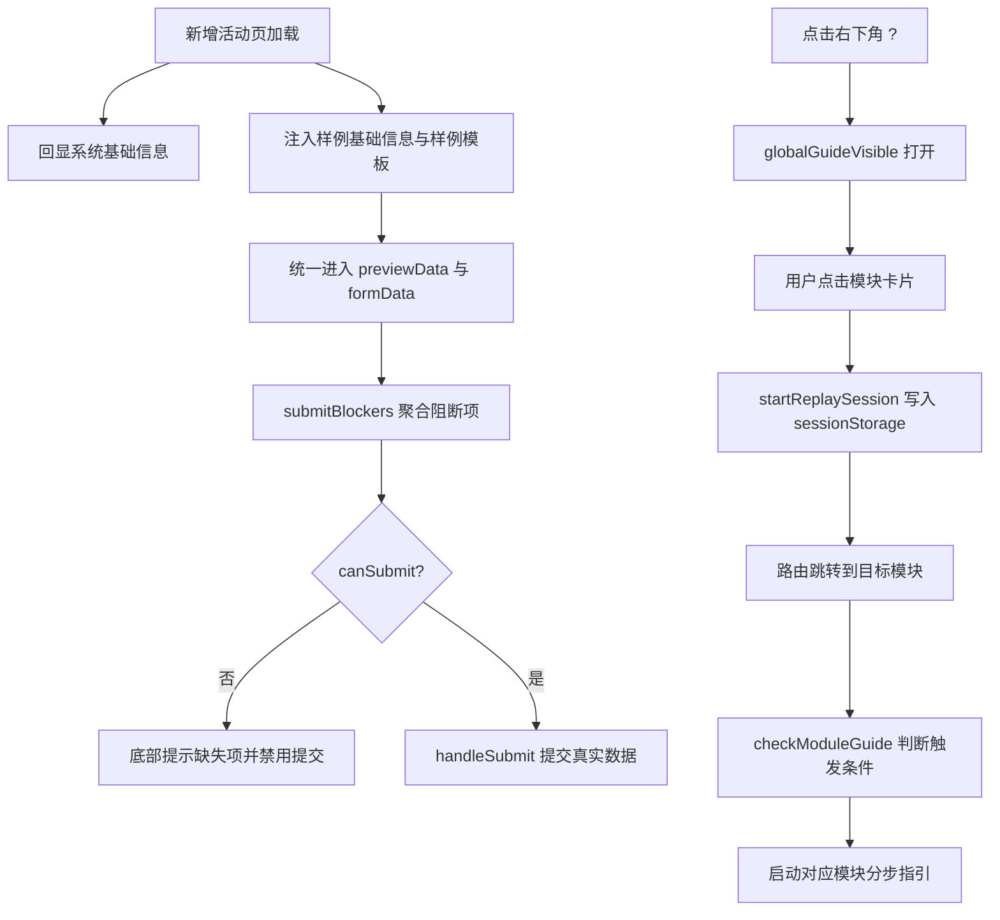

# 新增活动页面预填模板预览与用户指引优化设计文档

> 生成日期：2026-07-14 | 主题范围：新增活动页样例预填、模板预览、提交控制与全局用户指引重放链路 | feature-id: 2026-07-14-新增活动页面预填模板预览与用户指引优化

## 目录

- [概述 / Overview](#概述--overview)
- [架构设计 / Architecture](#架构设计--architecture)
- [核心模块 / Core%20Modules](#核心模块--core-modules)
- [技术决策 / Key%20Decisions](#技术决策--key-decisions)
- [已知限制 / Known%20Limits](#已知限制--known-limits)
- [扩展方向 / Extension%20Points](#扩展方向--extension-points)
- [相关资源 / References](#相关资源--references)

## 概述 / Overview

本次 feature 由两个前端入口共同完成：一是新增活动页面中的样例预填、模板预览与提交控制；二是全局用户指引中的首次登录自动触发与问号入口重放链路。整体目标不是削弱样例和指引，而是把“教学态”和“正式操作态”拆开，使用户既能借助系统内置样例快速理解页面，又不能把样例内容直接带入正式提交。

当前实现的技术重心在于统一状态收口。新增活动页面通过计算属性聚合基础信息、模板文件和流程模型配置的阻断条件，把零散校验改造成单一的提交规则出口。用户指引则把“首次登录”和“手动重放”这两类触发场景显式建模，并通过会话级状态贯通跨页面跳转。

当前 feature 已补充 knowledge 与 plan 源文档，但尚未单独沉淀 spec。因此本文以已归档的 knowledge 结论和 plan 拆分为主，描述已落地实现的技术结构、关键决策和后续扩展点。

## 架构设计 / Architecture

### 整体结构

本次设计围绕以下四层展开：

1. **页面交互层**：负责表单、上传、预览弹窗、引导弹窗和分步气泡的展示。
2. **规则聚合层**：负责样例识别、提交流程阻断、预览文案切换和模块指引触发判断。
3. **会话状态层**：负责 localStorage 与 sessionStorage 中的首次登录、模块已看过状态和问号重放会话状态。
4. **外部依赖层**：包括 `/isFirstLogin` 接口、活动基础信息接口、活动提交接口和样例模板静态资源。

### 新增活动页的数据流

新增活动页的核心状态集中在 `formData`、`previewData`、`processModelConfig` 三组数据结构中：

1. `formData` 承载基础信息、客户类型、模板文件、数据来源和回单表单值。
2. `previewData` 承载样例模板或真实模板解析后的派单字段和回单字段。
3. `processModelConfig` 承载流程模型、任务类型和区域级别配置。

这三组状态通过计算属性向外暴露为一组稳定的页面能力：

1. `hasSampleBasicInfo` 识别当前是否仍停留在样例态。
2. `hasRealTemplateFile` 区分当前模板是否为用户真实上传。
3. `submitBlockers` 把样例未替换、正式模板缺失、客户类型缺失、流程模型缺失等条件收敛成一个阻断清单。
4. `canSubmit` 作为最终提交开关，统一作用于按钮禁用态和 `handleSubmit` 内部兜底校验。

### 用户指引的数据流

用户指引存在两类不同生命周期的状态：

1. **长期状态**：由 `localStorage` 保存全局指引是否看过、各模块指引是否看过，适用于“避免重复打扰”。
2. **会话状态**：由 `sessionStorage` 保存本轮问号重放是否激活、哪些模块在本轮已经展示过，适用于“跨页面连续展示”。

两类状态分别解决不同问题：

1. `GUIDE_STORAGE_KEY` 和 `MODULE_GUIDE_PREFIX` 表达历史完成情况。
2. `GUIDE_REPLAY_SESSION_KEY` 和 `GUIDE_REPLAY_SESSION_SHOWN_KEY` 表达本轮重放进度。
3. `checkModuleGuide` 同时读取 `firstLoginResult` 与 `isReplaySessionActive()`，把自动触发条件严格收口到首次登录和问号重放两条路径。

## 核心模块 / Core Modules

### 新增活动页表单与提交控制

对应文件：[src/views/workflow/work/insertActivityDetail.vue](../../../../src/views/workflow/work/insertActivityDetail.vue)

该模块承担三类职责：

1. 初始化页面基础信息，并保留活动名称、活动内容、活动要求的样例值。
2. 承接模板上传、模板预览和流程模型配置。
3. 在提交前统一判断是否已经从样例态切换到真实录入态。

实现上，页面没有把校验散落在多个事件中，而是采用“先聚合、后控制”的方式：

1. `submitBlockers` 输出页面当前仍然缺失的真实信息和配置项。
2. `canSubmit` 为按钮禁用态提供唯一信号源。
3. `handleSubmit` 在按钮层之外再做一次兜底判断，防止边界情况下误提交。

这种设计的好处是页面提示和提交流程共用同一套规则，减少“文案说不能提、按钮却还能点”的分叉状态。

### 模板预览统一层

对应文件：[src/views/workflow/work/insertActivityDetail.vue](../../../../src/views/workflow/work/insertActivityDetail.vue)

该模块负责把样例模板和真实模板统一进同一条预览链路，避免维护两套弹窗和两套字段说明。

核心能力包括：

1. 通过 `previewSource` 标记当前预览来源。
2. 通过 `previewGuideSummary` 和 `previewGuideItems` 切换顶部说明文案。
3. 通过 `paidanFieldRows` 将派单字段按顺序组织成只读网格。
4. 通过 `visibleHuidanFields`、`huidanFieldRows` 和字段联动逻辑组织回单字段的只读效果。

统一预览结构后，样例模板和真实模板只在“来源说明”和“提交资格”上有差异，在字段展示层保持一致，降低了学习成本和维护成本。

### 重置与状态回收层

对应文件：[src/views/workflow/work/insertActivityDetail.vue](../../../../src/views/workflow/work/insertActivityDetail.vue)

`handleResetPrefill` 的职责不是简单清空几个输入框，而是把页面整体回收到“可重新录入”的初始状态。该逻辑包含四个动作：

1. 保留系统自动带出的活动编码、发起人、发布部门等基础字段。
2. 清空用户可编辑字段、模板文件、回单预览和数据来源状态。
3. 重置 `processModelConfig`，并通过递增 `processModelConfigKey` 触发子组件重新挂载。
4. 关闭预览弹窗并清理校验状态，保证用户可以从干净状态重新操作。

由于流程模型配置组件内部含有节点选择和模型状态，仅重置父级对象不足以确保完全回收，因此重新挂载是这里的关键技术点。

### 全局用户指引与重放层

对应文件：[src/components/UserGuide/index.vue](../../../../src/components/UserGuide/index.vue)

该模块负责全局引导弹窗、页面分步引导和问号帮助入口，是本次跨页面连续指引的核心实现位置。

模块职责拆分如下：

1. `checkGlobalGuide` 和 `isFirstLogin` 负责首次登录语义判断。
2. `reopenGuide` 负责从问号入口重新打开全局引导，并标记本轮需要开启 replay session。
3. `handleModuleClick` 在用户点击模块卡片时决定是清理历史模块状态还是启动本轮重放。
4. `checkModuleGuide` 在路由切换后基于首次登录状态、历史完成状态和 replay session 状态决定是否自动展示分步指引。
5. `markReplayGuideShown` 负责避免同一轮会话在同一模块重复展示。

这套结构把“历史去重”和“当前会话连续性”拆成两层状态模型，是本次用户指引改造的核心。

### 首次登录语义对齐层

对应文件：[src/api/login.js](../../../../src/api/login.js)

`/isFirstLogin` 的接口注释明确约定 `true = 首次登录，需展示用户指引`。用户指引组件需要严格遵守这个语义，否则会出现首次用户不弹引导、老用户反而被打断的问题。该文件虽然变更很小，但它为整个指引触发链路提供了唯一的后端语义锚点。

## 技术决策 / Key Decisions

### 决策一：保留样例态，不走“默认空白页”方案

- **选择**：保留样例基础信息和样例模板文件，但把样例态与提交流程彻底解耦。
- **原因**：用户仍需要样例帮助理解字段结构与录入目标，直接移除样例会削弱教学能力。
- **替代方案**：改为完全空白初始页，依赖纯文本用户指引。该方案降低了误提交风险，但会显著抬高首次使用成本。

### 决策二：将提交规则收口到计算属性而非散落事件处理

- **选择**：以 `submitBlockers` 和 `canSubmit` 作为唯一的提交规则出口。
- **原因**：页面存在基础信息、模板、流程模型三类前置条件，单点聚合可以避免条件分裂和状态不一致。
- **替代方案**：在每个输入事件、上传事件和提交事件内分别判断。该方案实现快，但长期维护成本高，且容易漏掉组合条件。

### 决策三：样例模板与真实模板共用同一套预览结构

- **选择**：统一通过 `previewData` 渲染预览，仅用顶部说明区分来源。
- **原因**：用户学习模板和核对真实模板都依赖同一套字段布局，没有必要维护两套视觉结构。
- **替代方案**：样例模板单独使用静态说明页，真实模板使用解析弹窗。该方案会造成学习体验和提交前核对体验割裂。

### 决策四：用 sessionStorage 表达问号重放会话

- **选择**：把问号入口触发的一轮引导定义为 replay session，并由 `sessionStorage` 记录。
- **原因**：`localStorage` 只能表达“曾经是否看过”，不能表达“当前这轮重放是否仍然有效”。
- **替代方案**：每次点击问号都清空全部模块已看状态。该方案会污染长期状态，并导致用户日常进入页面时重新被自动打断。

### 决策五：非首次登录的侧边菜单进入只保留问号，不自动弹指引

- **选择**：在 `checkModuleGuide` 中，当 `firstLoginResult` 为假且 replay session 未激活时直接返回。
- **原因**：自动指引的触发范围必须收口，否则会持续影响高频使用用户。
- **替代方案**：保留原有自动触发策略，再增加开关。该方案会让规则分散，难以解释和维护。

## 已知限制 / Known Limits

| 限制 | 影响范围 | 应对措施 |
|------|----------|----------|
| 当前 feature 尚无独立 spec 文档 | 后续二次开发只能从 PRD、knowledge 和 plan 补读上下文 | 后续补一份稳定 spec，把规则、边界和验收口径独立沉淀 |
| replay session 仅记录模块是否展示过，不记录步骤级进度 | 用户中断后重新进入时，只能重放模块，不会恢复到具体步骤 | 若后续需要细粒度恢复，可将步骤索引一并写入 sessionStorage |
| 模板预览依赖前端字段映射和样例模板格式 | 模板规范变动时，预览说明、字段排序和控件示意都需要同步调整 | 在模板规范调整时同步更新样例模板与说明文案 |
| 重置逻辑默认保留系统带出字段 | 若业务方希望“彻底清空”，当前行为可能与预期不一致 | 在后续 spec 中明确保留字段边界，必要时增加可配置策略 |
| 仓库级 ESLint 对 Vue 文件存在历史噪音 | 不能直接用全量 lint 作为本 feature 唯一质量门槛 | 继续使用页面级校验或编辑器错误作为本特性的定向验证手段 |

## 扩展方向 / Extension Points

1. **规则抽象化**：将 `submitBlockers` 抽为可复用规则清单，供其他活动发起页或类似表单页共享。
2. **重放态可视化**：在问号触发的 replay session 期间增加明显视觉标记，帮助用户理解当前处于帮助模式。
3. **指引状态精细化**：除模块维度外，补充步骤级会话状态，以支持中断恢复、跳步和引导统计。
4. **预览层组件化**：将派单字段网格和回单字段只读渲染提取为通用预览组件，减少后续页面复制成本。
5. **文档资产补全**：补齐 spec、前端测试说明和模板规范文档，使后续 docgen 不再依赖补录型源材料。

## 相关资源 / References

1. 页面实现入口：[src/views/workflow/work/insertActivityDetail.vue](../../../../src/views/workflow/work/insertActivityDetail.vue)
2. 用户指引入口：[src/components/UserGuide/index.vue](../../../../src/components/UserGuide/index.vue)
3. 首次登录接口定义：[src/api/login.js](../../../../src/api/login.js)
4. 样例模板资源：[public/templates/sample-dispatch-template.xlsx](../../../../public/templates/sample-dispatch-template.xlsx)
5. 流程模型配置组件：[src/views/workflow/work/components/ProcessModelConfig.vue](../../../../src/views/workflow/work/components/ProcessModelConfig.vue)
