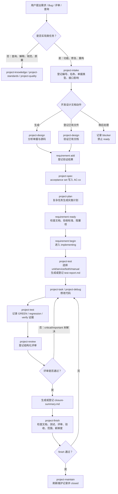

# Project Intelligence 项目说明

Project Intelligence 是一个同时适配 Claude Code 和 Codex 的本地项目智能插件。它把需求开发从“靠约定提醒”推进到“有需求档案、有测试报告、有评审证据、有收口总结、有维护关闭”的闭环流程。

插件不替代业务代码开发本身，而是提供一套项目级工作流：

- 先登记需求号、需求名称、Bug/Requirement 类型和对外接口影响。
- 再由 `project-design` 生成或验证源码佐证设计文档，由 `project-spec` 把验收标准独立写入 manifest。
- ready 后才允许进入实现。
- 测试、评审、finish、maintain 都写入需求级 manifest。
- 证据使用当前 Git diff hash 校验，代码变化后旧测试和旧评审会过期。
- 项目知识、规范、质量检查、图谱上下文统一沉淀在 `.project-intel/`。

## 一、项目核心能力

| 能力 | 说明 |
| --- | --- |
| 需求级档案 | 每个需求独立归档到 `.project-intel/requirements/by-id/<requirement-id>/`。 |
| 强制状态机 | 固定流转 `draft -> documented -> ready -> implementing -> verified -> reviewed -> finished -> closed`。 |
| 必选产物 | 经过模板校验的开发设计文档、测试报告、复盘收口总结。 |
| 独立设计 Skill | `project-design` 可只生成文档，不初始化或修改 `.project-intel`。 |
| 测试门禁 | 普通需求至少需要通过的单元测试或服务测试；对外接口需求必须有服务测试。 |
| 人工例外 | 仅限视觉、真机、硬件、纯配置等场景，并要求审批式报告和截图/日志路径。 |
| 持久化评审 | review 结果、问题级别、文件范围和 diff hash 写入 manifest。 |
| 新鲜度校验 | finish 时重新计算 Git 变更范围和 diff hash，防止旧证据绕过。 |
| 项目知识库 | 初始化和刷新项目事实、规范、知识、图谱摘要、维护记录。 |
| 双平台适配 | 同一套 skills 可用于 Claude Code 和 Codex。 |

## 二、整体流程图



## 三、需求状态机

| 状态 | 含义 | 进入条件 |
| --- | --- | --- |
| `draft` | 已登记需求号和名称 | `intake` 创建需求档案。 |
| `documented` | 已登记开发设计文档 | 文档存在、哈希当前有效且通过对应 Bug/Requirement 模板校验。 |
| `ready` | 允许开始实现 | 设计文档有效、manifest 验收标准完整，所有 blocker 有解决说明。 |
| `implementing` | 正在实现 | `requirement begin` 通过 readiness 再检查。 |
| `verified` | 测试证据满足当前代码 | 至少一份有效通过测试，且满足接口影响规则。 |
| `reviewed` | 当前代码通过评审 | 无未解决 critical/important 问题，评审 diff hash 当前有效。 |
| `finished` | 收口门禁通过 | 文档、测试、评审、验收标准、收口总结全部满足。 |
| `closed` | 维护刷新完成 | `maintain` 从 `finished` 成功执行。 |

`reopen` 必须填写原因。重新打开后会保留历史记录，但旧测试、旧评审和旧收口结果会失效。

## 四、目录结构

```text
docs/
└── requirements/
    └── <ticket-id>_<name>_设计文档.md

.project-intel/
├── manifest.json
├── config.json
├── standards/
├── knowledge/
├── graph/
├── reports/
├── maintenance/
└── requirements/
    └── by-id/
        └── <safe-requirement-id>/
            ├── manifest.json
            ├── <id>_<name>_设计文档.md（仅兼容脚手架）
            ├── test-report.md
            └── closure-summary.md
```

说明：

- `.project-intel/manifest.json` 是项目级事实入口。
- `.project-intel/config.json` 保存规则、扫描范围、质量命令。
- `.project-intel/requirements/by-id/*/manifest.json` 是需求级真相来源。
- `docs/requirements/` 是 `project-design` 的默认输出位置；生命周期只在 manifest 中登记其仓库相对路径、哈希和验证结果，不复制正文。
- `.project-intel/requirements/files` 保留兼容视图，不自动迁移到需求级历史。

## 五、常用 CLI 使用说明

### 1. 初始化和诊断

```bash
project-intel --project /path/to/repo init --dry-run
project-intel --project /path/to/repo init
project-intel --project /path/to/repo doctor --json
project-intel --project /path/to/repo graph-tools --json
```

`init` 和普通 `refresh` 默认只更新 `.project-intel` 事实，不修改根目录 `AGENTS.md`、`CLAUDE.md`、`.gitignore`。只有显式执行 `install` 或 `refresh --adapters` 才更新适配器文件。

图谱分析默认关闭。运行仓库 runner、环境变量提供的命令或引用项目外绝对路径时，需要分别显式授权：

```bash
project-intel --project /path/to/repo refresh --with-graph --allow-repo-runner
project-intel --project /path/to/repo refresh --with-graph --allow-env-command
project-intel --project /path/to/repo refresh --with-graph --allow-external-path
```

### 2. 登记需求

```bash
project-intel --project /path/to/repo intake \
  --requirement-id REQ-1001 \
  --requirement-name "订单导出增加筛选条件" \
  --ticket-kind requirement \
  --external-api no \
  --track auto
```

没有正式需求号时，Agent 使用 `LOCAL-YYYYMMDD-HHMMSS`。

### 3. 生成或登记开发设计文档

在 Agent 中可直接使用 `$project-intelligence:project-design`（Codex）或 `/project-intelligence:project-design`（Claude Code）。只要求设计文档时，不会启动需求生命周期。

生命周期中的 `generate` 由 `project-design` 分析本地单据和源码后写入：

```text
docs/requirements/bug1234-名称-设计文档.md
docs/requirements/CRM-req73822_名称_设计文档.md
```

`requirement generate --type requirement-design` 只保留为兼容脚手架，生成后仍是 `draft`，不能直接通过 ready。

生成或已有文档都必须经过验证后登记：

```bash
python3 plugins/project-intelligence/skills/project-design/scripts/validate_design_doc.py \
  --file docs/requirements/REQ-1001_订单导出增加筛选条件_设计文档.md \
  --repo /path/to/repo \
  --kind requirement \
  --json
```

```bash
project-intel --project /path/to/repo requirement add \
  --requirement-id REQ-1001 \
  --type requirement-design \
  --path docs/requirements/REQ-1001_订单导出增加筛选条件_设计文档.md
```

随后由 `project-spec` 独立登记验收标准，不修改设计文档模板：

```bash
project-intel --project /path/to/repo requirement acceptance set \
  --requirement-id REQ-1001 \
  --criterion "AC-01:按条件导出正确订单" \
  --criterion "AC-02:原有导出场景回归通过"
```

### 4. readiness 和开始实现

```bash
project-intel --project /path/to/repo requirement ready \
  --requirement-id REQ-1001 \
  --resolution "需求、设计和验收标准已确认，无未解决阻塞项"

project-intel --project /path/to/repo requirement begin \
  --requirement-id REQ-1001
```

缺少需求/设计文档、缺少验收标准或存在未解决 blocker 时，`ready` 会失败。

### 5. 记录测试报告

RED 示例：

```bash
project-intel --project /path/to/repo test \
  --requirement-id REQ-1001 \
  --test-kind unit \
  --report-action generate \
  --phase red \
  --command "npm test -- tests/order-export.test.ts" \
  --expect-failure "export filter is missing" \
  --files src/order/export.ts tests/order-export.test.ts \
  --acceptance AC-01
```

GREEN 示例：

```bash
project-intel --project /path/to/repo test \
  --requirement-id REQ-1001 \
  --test-kind unit \
  --report-action generate \
  --phase green \
  --command "npm test -- tests/order-export.test.ts" \
  --files src/order/export.ts tests/order-export.test.ts \
  --acceptance AC-01,AC-02
```

规则：

- `--files` 不能为空，除非显式使用 `--project-wide`。
- RED 必须提供 `--expect-failure` 并匹配输出。
- pytest exit 2/3/4/5、命令不存在、超时、基础设施错误不算有效 RED。
- GREEN、regression、verify 只接受退出码 0。
- 对外接口影响为 yes 的需求必须有 service 或 both 类型测试。

### 6. 登记评审

```bash
project-intel --project /path/to/repo review \
  --requirement-id REQ-1001 \
  --result passed \
  --summary "无阻塞问题" \
  --files src/order/export.ts tests/order-export.test.ts
```

带问题示例：

```bash
project-intel --project /path/to/repo review \
  --requirement-id REQ-1001 \
  --result failed \
  --summary "存在重要问题" \
  --finding important:"导出接口缺少边界条件测试" \
  --files src/order/export.ts tests/order-export.test.ts
```

critical 或 important 未解决时不能进入 finish。

修复后按稳定 ID 解决 finding，再执行一轮当前代码快照上的 review：

```bash
project-intel --project /path/to/repo requirement resolve-finding \
  --requirement-id REQ-1001 \
  --finding-id FINDING-01-01 \
  --resolved-by "reviewer" \
  --resolution "已补充边界测试并复核"
```

### 7. 收口和维护

```bash
project-intel --project /path/to/repo requirement generate \
  --requirement-id REQ-1001 \
  --type closure

project-intel --project /path/to/repo finish \
  --requirement-id REQ-1001 \
  --files src/order/export.ts tests/order-export.test.ts

project-intel --project /path/to/repo maintain \
  --requirement-id REQ-1001 \
  --files src/order/export.ts tests/order-export.test.ts
```

`finish` 会检查：

- 当前状态必须是 `reviewed`。
- 需求/设计文档存在且当前有效。
- 测试报告存在，测试类型满足需求规则，测试结果通过。
- 测试和评审证据未过期。
- 所有验收标准有通过证据或已批准的人工例外。
- 无未解决 critical/important 评审问题。
- 收口总结已生成或登记。
- `--files` 覆盖实际业务代码变更，不能遗漏修改、未跟踪、删除或重命名文件。

`maintain` 只能从 `finished` 开始，并重新比较 finish 时的 Git commit 和 diff hash；finish 后代码或提交变化会拒绝关闭。维护失败时需求保持 `finished`。

## 六、Skill 总览和触发词

| Skill | 用途 | 常见触发词 |
| --- | --- | --- |
| `project-init` | 首次初始化项目智能，生成 `.project-intel` 项目事实。 | 初始化项目、项目初始化、搭建项目、创建项目、项目搭建、初始化 |
| `project-refresh` | 刷新项目事实、规范、知识、图谱摘要、质量配置或适配器。 | 刷新、更新、刷新项目、更新项目、刷新知识库、更新知识库、图谱完成、understand完成 |
| `project-intake` | 实现前做需求入口分析，登记需求号/名称/对外接口影响，判断 track 和 readiness。 | 需求入口分析、需求分流、clarify scope、quick/standard/complex、readiness |
| `project-brainstorm` | 需求还不清楚时做脑暴、方案比较、范围澄清。 | 需求脑暴、比较方案、明确范围、功能应该怎么做、before code changes |
| `project-design` | 分析本地 Bug/需求单和源码，生成或验证开发设计文档；支持独立和生命周期模式。 | 根据 Bug 单写开发设计文档、把需求单转成技术设计、生成本地需求开发设计文档、写 Bug 修复设计说明 |
| `project-spec` | 设计登记后澄清需求边界，并把编号验收标准写入 manifest。 | 需求澄清、验收标准、需求涉及关系和规范、acceptance criteria |
| `project-plan` | 把已确认需求转成实施计划、任务清单和验证路径。 | 技术方案、实施计划、开发步骤、task checklist、execution plan |
| `project-task` | 实现功能、修复、重构前读取项目规范、复用点、图谱和后续维护要求。 | 需求开发、功能开发、实现需求、开发任务、做需求、写功能 |
| `project-debug` | 排查 bug、错误、回归、测试失败，结合项目规范和 systematic-debugging。 | 查询bug、排查bug、定位问题、root cause、regression、unexpected behavior |
| `project-test` | 选择测试类型、报告动作，记录 RED/GREEN/回归/验证/人工例外证据。 | 测试、单元测试、回归测试、TDD、测试优先、验证证据 |
| `project-review` | 审查代码变更、PR、diff、复用风险、测试缺口，并写入结构化评审。 | 代码审查、代码评审、PR审查、代码检查、审查代码、review、review代码 |
| `project-finish` | 完成前检查验收证据、范围漂移、发布风险、收口总结。 | 收口、完成检查、验收证据、交付前检查、release readiness |
| `project-maintain` | 完成后刷新项目知识库、维护记录、生命周期产物，并关闭需求。 | 维护、项目维护、更新知识库、生命周期维护、完成任务 |
| `project-quality` | 执行或解释 lint、type-check、style、format、冗余和质量报告。 | 质量检查、代码质量、检查工具、lint检查、质量报告 |
| `project-standards` | 查询、解释、提升或降低 hard/preferred/inferred/candidate 规则。 | 项目规范、规范、代码规范、标准、规则 |
| `project-knowledge` | 回答项目结构、组件、API、服务、模块、业务流和复用模式问题。 | 项目知识、项目结构、项目架构、组件、接口、服务、模块 |
| `project-orchestrate` | 计划可拆分且文件边界清晰时，编排子任务、任务级 review 和最终 review。 | 子代理开发、多任务编排、agent执行计划、并行分析、分任务实现 |

## 七、典型使用场景

### 场景 A：做一个普通功能

```text
用户：给订单导出增加按状态筛选。
Agent：触发 project-intake，询问需求号、需求名、是否影响对外接口、文档动作。
Agent：触发 project-design，生成并登记严格模板的开发设计文档。
Agent：触发 project-spec，把 AC-01/AC-02 写入 manifest。
Agent：ready -> begin。
Agent：触发 project-test，询问 unit/service/both/manual 和报告动作。
Agent：写 RED 测试 -> 实现 -> GREEN/回归。
Agent：触发 project-review，登记评审。
Agent：生成 closure-summary.md。
Agent：project-finish 通过后 project-maintain，需求 closed。
```

### 场景 B：修一个 bug

```text
用户：排查保存订单时偶发 500。
Agent：需要改代码时先由 project-intake 登记为 Bug，再触发 project-debug 定位错误链路和根因。
Agent：触发 project-design 生成精简五段式 Bug 修复设计，project-spec 登记 AC。
Agent：ready 后转入 project-test/project-task。
Agent：用 RED 复现 bug，再修复并记录 GREEN/回归证据。
Agent：review、finish、maintain。
```

### 场景 C：只问项目结构

```text
用户：这个项目接口层在哪？
Agent：触发 project-knowledge。
Agent：优先读取 .project-intel/manifest.json、knowledge、graph、reports，再直接查源码。
Agent：只回答结构，不强制进入需求状态机。
```

### 场景 D：只做质量检查

```text
用户：跑下质量检查。
Agent：触发 project-quality。
Agent：默认运行 project-intel check；需要真实 lint/type/style/format 时使用 --run-quality。
```

### 场景 E：任务可拆分

```text
用户：按这个计划实现，分几块并行做。
Agent：触发 project-orchestrate。
Agent：所有子任务共享同一个 requirement-id。
Agent：子任务只能追加自己的证据，不能覆盖整个 manifest。
Agent：最终仍由主流程 review、finish、maintain 收口。
```

### 场景 F：只生成开发设计文档

```text
用户：根据这个本地需求单和当前代码生成开发设计文档，不改代码。
Agent：只触发 project-design，读取单据和源码。
Agent：写入 docs/requirements/，运行模板和敏感信息验证器。
Agent：不运行 intake，也不创建或修改 .project-intel。
```

## 八、使用纪律

- 实现类任务不要绕过需求号、需求名称和对外接口影响确认。
- `project-test` 必须询问测试类型和报告动作。
- “稍后处理”可以记录，但会形成 blocker，不能直接 ready 或 finish。
- 人工测试是审批式例外，不是默认测试类型。
- review 后如果代码变化，旧 review 失效。
- test 后如果代码变化，旧测试证据失效。
- finish 前必须有 closure summary。
- maintain 不等于 finish；未 finished 不能 closed。
- finish 后代码或 Git 提交变化必须重新测试、评审和 finish，不能直接 maintain。
- 插件不会自动 npm 发布、git push、部署或安装本地插件，除非用户明确要求。

## 九、推荐对话方式

可以直接这样对 Agent 说：

```text
用 project-intelligence 做这个需求，需求号 REQ-1001，需求名“订单导出增加状态筛选”，不影响对外接口。
```

也可以让 Agent 询问：

```text
帮我按项目流程做这个功能，需求号还没有。
```

如果只是查知识：

```text
这个项目的接口服务和前端调用链路是什么？
```

如果只是评审：

```text
审查当前 diff，看有没有测试缺口和流程门禁问题。
```

如果要收口：

```text
按 project-finish 检查这个需求，确认能不能进入 maintain。
```
