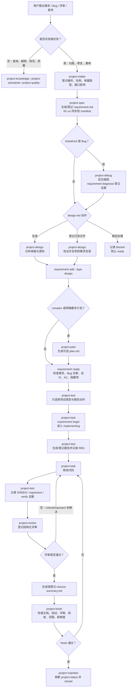

# Project Intelligence 项目说明

Project Intelligence 是一个同时适配 Claude Code 和 Codex 的本地项目智能插件。它把需求开发从“靠约定提醒”推进到“有需求档案、有测试报告、有评审证据、有收口总结、有维护关闭”的闭环流程。

插件不替代业务代码开发本身，而是提供一套项目级工作流：

- 先登记需求号、需求名称、Bug/Requirement 类型和对外接口影响。
- 再由 `project-spec` 形成需求文档和验收标准；Bug 先由 `project-debug` 登记根因证据，然后由 `project-design` 生成或验证源码佐证设计文档。
- `project-test` 先明确测试合同（类型、报告动作、AC 映射），ready 后才允许进入实现。
- 测试、评审、finish、maintain 都写入需求级 manifest。
- 证据使用当前 Git diff hash 校验，代码变化后旧测试和旧评审会过期。
- 项目知识、规范、质量检查、图谱上下文统一沉淀在 `.project-intel/`。

## 一、项目核心能力

| 能力 | 说明 |
| --- | --- |
| 需求级档案 | 每个需求直接归档到 `.project-intel/requirements/<requirement-id>/`。 |
| 强制状态机 | 固定流转 `draft -> specified -> designed -> ready -> implementing -> verified -> reviewed -> finished -> closed`。 |
| 必选产物 | `requirement.md`、`design.md`、`test-report.md`、`closure-summary.md`。 |
| 可选计划 | complex 任务或用户明确要求时生成同目录 `plan.md`。 |
| 独立设计 Skill | `project-design` 可只生成文档，不初始化或修改 `.project-intel`。 |
| 测试门禁 | 普通需求至少需要通过的单元测试或服务测试；对外接口需求必须有服务测试。 |
| 人工例外 | 仅限视觉、真机、硬件、纯配置等场景，并要求审批式报告和截图/日志路径。 |
| 持久化评审 | review 结果、问题级别、文件范围和 diff hash 写入 manifest。 |
| 新鲜度校验 | finish 时重新计算 Git 变更范围和 diff hash，防止旧证据绕过。 |
| 项目知识库 | 初始化和刷新项目事实、规范、知识、图谱摘要、维护记录。 |
| 双平台适配 | 同一套 skills 可用于 Claude Code 和 Codex。 |

## 二、整体流程图



## 三、需求状态机

| 状态 | 含义 | 进入条件 |
| --- | --- | --- |
| `draft` | 已登记需求号和名称 | `intake` 创建需求档案。 |
| `specified` | 需求文档已确认 | `requirement.md` 当前有效，需求边界和 AC 已写入。 |
| `designed` | 开发设计已确认 | `design.md` 当前有效并通过 Bug/Requirement 模板校验。 |
| `ready` | 允许开始实现 | 需求、设计、manifest AC、显式测试合同均有效；Bug 还必须有当前有效的根因诊断；所有 blocker 有解决说明。 |
| `implementing` | 正在实现 | `requirement begin` 通过 readiness 再检查。 |
| `verified` | 测试证据满足当前代码 | 至少一份有效通过测试，且满足接口影响规则。 |
| `reviewed` | 当前代码通过评审 | 无未解决 critical/important 问题，评审 diff hash 当前有效。 |
| `finished` | 收口门禁通过 | 文档、测试、评审、验收标准、收口总结全部满足。 |
| `closed` | 维护刷新完成 | `maintain` 从 `finished` 成功执行。 |

`reopen` 必须填写原因。重新打开后会保留历史记录，但旧测试、旧评审和旧收口结果会失效。

## 四、目录结构

```text
.project-intel/
├── .gitignore
├── manifest.json
├── config.json
├── project-status.md
├── standards/
├── knowledge/
├── graph/
├── cache/                 # 忽略，本机缓存
├── local/                 # 忽略，本机工具状态
├── tmp/                   # 忽略，临时编排文件
└── requirements/
    └── <safe-requirement-id>/
        ├── manifest.json
        ├── requirement.md
        ├── design.md
        ├── plan.md         # 可选
        ├── test-report.md
        └── closure-summary.md

docs/requirements/         # 仅 project-design 独立模式的输出，不属于生命周期
```

说明：

- `.project-intel/manifest.json` 是项目级事实入口。
- `.project-intel/config.json` 保存规则、扫描范围、质量命令。
- `.project-intel/project-status.md` 是项目级可覆盖的当前状态，不保存需求历史。
- `.project-intel/requirements/*/manifest.json` 是需求级真相来源，记录 AC、变更文件、测试、评审、finish、maintenance 和状态历史。
- `plan.md` 不生成时完全可选；一旦选择生成，就必须补全文件级步骤、测试/AC 映射和回滚方案并重新登记，后续篡改会阻止 ready 或 begin。
- `test-report.md` 是当前需求的持续追加记录，不会被其他需求覆盖；每轮执行包含测试类型、结果、覆盖范围、AC、Git commit 和代码快照，登记的外部报告另存脱敏证据副本。
- `docs/requirements/` 只用于 `project-design` 独立模式；生命周期登记外部已有文档时会验证并复制为需求目录中的规范文件名。
- 已验证的设计、测试报告、收口总结仍属于交付 diff 和评审范围，但不要求作为业务源码被测试覆盖；业务源码不能通过改名或登记成 artifact 来逃避覆盖门禁。
- 新流程不创建 `reports/specs/plans/maintenance`、`requirements/by-id` 或 `requirements/files`。旧 `by-id` 可通过 `requirement migrate` 预览并迁移；无法可靠归属需求的旧共享文件只报告，不自动猜测。

## 五、常用 CLI 使用说明

### 1. 初始化和诊断

```bash
project-intel --project /path/to/repo init --dry-run
project-intel --project /path/to/repo init
project-intel --project /path/to/repo doctor --json
project-intel --project /path/to/repo graph-tools --json
```

`init` 默认检查图谱工具、运行已安装的 shell 分析器并更新 `.project-intel`；交互终端会询问缺失工具，非交互环境不会等待输入。使用 `init --no-graph` 可只生成项目事实。普通 `refresh` 仍只读取已有图谱产物。两者都不修改根目录 `AGENTS.md`、`CLAUDE.md`、`.gitignore`；只有显式执行 `adapters apply`、`install` 或 `refresh --adapters` 才更新适配器文件。

`refresh` 的图谱重跑默认关闭。运行仓库 runner、环境变量提供的命令或引用项目外绝对路径时，需要分别显式授权：

```bash
project-intel --project /path/to/repo refresh --with-graph --allow-repo-runner
project-intel --project /path/to/repo refresh --with-graph --allow-env-command
project-intel --project /path/to/repo refresh --with-graph --allow-external-path
```

### 2. 登记需求

```bash
project-intel --project /path/to/repo intake \
  --requirement-id REQ-1001 \
  --requirement-name "订单导出增加筛选条件" \
  --ticket-kind requirement \
  --external-api no \
  --requirement-action generate \
  --design-action generate \
  --track auto
```

没有正式需求号时，Agent 使用 `LOCAL-YYYYMMDD-HHMMSS`。
如果选择登记已有文件，动作改为 `register`，并同时传 `--requirement-path` 或 `--design-path`。这些选择会写入 `manifest.workflowSelections`，换会话或交给子任务后通过 `requirement status --json` 原样恢复。

### 3. 生成需求文档和验收标准

`project-spec` 先完善 `requirement.md`，把同一组 AC 写入 manifest，再登记文档：

```bash
project-intel --project /path/to/repo requirement generate \
  --requirement-id REQ-1001 --type requirement

project-intel --project /path/to/repo requirement acceptance set \
  --requirement-id REQ-1001 \
  --criterion "AC-01:按条件导出正确订单" \
  --criterion "AC-02:原有导出场景回归通过"

project-intel --project /path/to/repo requirement add \
  --requirement-id REQ-1001 --type requirement \
  --path .project-intel/requirements/REQ-1001/requirement.md
```

脚手架带占位符，必须由 Agent 补齐；仅生成不能进入 `specified`。

`requirement generate` 默认只创建不存在的文档。如果规范文件已存在，应继续编辑并验证原文件；只有用户明确同意替换时才使用 `--replace`。

Bug 在进入设计前必须登记根因和源码证据：

```bash
project-intel --project /path/to/repo requirement diagnose \
  --requirement-id bug1001 \
  --root-cause "业务分支错误使用了默认值" \
  --evidence "src/order/service.ts#submitOrder"
```

证据必须是仓库内相对路径，可用 `path#symbol` 精确到符号；需要多个源码位置时可重复传入 `--evidence`。未登记当前 Bug 诊断时，`requirement ready` 必须失败。

### 4. 生成或登记开发设计文档

在 Agent 中可直接使用 `$project-intelligence:project-design`（Codex）或 `/project-intelligence:project-design`（Claude Code）。只要求设计文档时，不会启动需求生命周期。

生命周期中的 `generate` 由 `project-design` 分析本地单据和源码后写入：

```text
.project-intel/requirements/bug1234/design.md
.project-intel/requirements/CRM-req73822/design.md
```

独立调用 `project-design` 时，Bug 输出 `docs/requirements/<bug编号>-<名称>-设计文档.md`，Requirement 输出 `docs/requirements/<需求号>_<名称>_设计文档.md`；两种模式都不会初始化或修改 `.project-intel`。

Requirement 使用 CRM 固定章节与顺序，但正文以中文业务叙述为主：场景分析必须说明场景名称、参与对象、前置条件、处理过程、目标结果和异常边界；实现方案按模块解释规则、字段流转、调用顺序和兼容处理。源码仅写 `相对路径#符号` 作为依据。最多允许 3 个关键代码块（每块不超过 10 行，总计不超过 30 行）；接口优先使用中文字段表。

生成或已有文档都必须经过验证后登记：

```bash
python3 plugins/project-intelligence/skills/project-design/scripts/validate_design_doc.py \
  --file .project-intel/requirements/REQ-1001/design.md \
  --repo /path/to/repo \
  --kind requirement \
  --json
```

```bash
project-intel --project /path/to/repo requirement add \
  --requirement-id REQ-1001 \
  --type design \
  --path .project-intel/requirements/REQ-1001/design.md
```

复杂需求或明确要求保留计划时，额外生成同目录可选文件：

```bash
project-intel --project /path/to/repo plan --requirement-id REQ-1001
```

`plan` 同样默认拒绝覆盖已存在的 `plan.md`；确认需要重建时才显式传入 `--replace`。

### 5. readiness 和开始实现

```bash
project-intel --project /path/to/repo requirement ready \
  --requirement-id REQ-1001 \
  --resolution "需求、设计和验收标准已确认，无未解决阻塞项"

project-intel --project /path/to/repo requirement begin \
  --requirement-id REQ-1001
```

缺少需求/设计文档、缺少验收标准或存在未解决 blocker 时，`ready` 会失败。

### 6. 记录测试报告

RED 示例：

```bash
project-intel --project /path/to/repo test \
  --requirement-id REQ-1001 \
  --test-kind unit \
  --report-action generate \
  --phase red \
  --command "npm test -- tests/order-export.test.ts" \
  --expect-failure "export filter is missing" \
  --files src/order/export.ts tests/order-export.test.ts \
  --acceptance AC-01
```

GREEN 示例：

```bash
project-intel --project /path/to/repo test \
  --requirement-id REQ-1001 \
  --test-kind unit \
  --report-action generate \
  --phase green \
  --command "npm test -- tests/order-export.test.ts" \
  --files src/order/export.ts tests/order-export.test.ts \
  --acceptance AC-01,AC-02
```

规则：

- `--files` 不能为空，除非显式使用 `--project-wide`。
- RED 必须提供 `--expect-failure` 并匹配输出。
- pytest exit 2/3/4/5、命令不存在、超时、基础设施错误不算有效 RED。
- GREEN、regression、verify 只接受退出码 0。
- 对外接口影响为 yes 的需求必须有 service 或 both 类型测试。

### 7. 登记评审

```bash
project-intel --project /path/to/repo review \
  --requirement-id REQ-1001 \
  --result passed \
  --summary "无阻塞问题" \
  --files src/order/export.ts tests/order-export.test.ts
```

带问题示例：

```bash
project-intel --project /path/to/repo review \
  --requirement-id REQ-1001 \
  --result failed \
  --summary "存在重要问题" \
  --finding important:"导出接口缺少边界条件测试" \
  --files src/order/export.ts tests/order-export.test.ts
```

critical 或 important 未解决时不能进入 finish。

修复后按稳定 ID 解决 finding，再执行一轮当前代码快照上的 review：

```bash
project-intel --project /path/to/repo requirement resolve-finding \
  --requirement-id REQ-1001 \
  --finding-id FINDING-01-01 \
  --resolved-by "reviewer" \
  --resolution "已补充边界测试并复核"
```

### 8. 收口和维护

```bash
project-intel --project /path/to/repo requirement generate \
  --requirement-id REQ-1001 \
  --type closure

project-intel --project /path/to/repo finish \
  --requirement-id REQ-1001 \
  --files src/order/export.ts tests/order-export.test.ts

project-intel --project /path/to/repo maintain \
  --requirement-id REQ-1001 \
  --files src/order/export.ts tests/order-export.test.ts
```

`finish` 会检查：

- 当前状态必须是 `reviewed`。
- 需求/设计文档存在且当前有效。
- 测试报告存在，测试类型满足需求规则，测试结果通过。
- 测试和评审证据未过期。
- 所有验收标准有通过证据或已批准的人工例外。
- 无未解决 critical/important 评审问题。
- 收口总结已生成或登记。
- `--files` 覆盖实际业务代码变更，不能遗漏修改、未跟踪、删除或重命名文件。

`maintain` 只能从 `finished` 开始，并重新比较 finish 时的 Git commit 和 diff hash；finish 后代码或提交变化会拒绝关闭。维护失败时需求保持 `finished`。

按业务文件查询关联需求，不再读取 `requirements/files` 镜像：

```bash
project-intel --project /path/to/repo requirement query --file src/order/export.ts
project-intel --project /path/to/repo requirement query --state closed
```

旧 `requirements/by-id` 布局默认只预览迁移动作，确认无冲突后再执行：

```bash
project-intel --project /path/to/repo requirement migrate
project-intel --project /path/to/repo requirement migrate --apply
```

## 六、Skill 总览和触发词

| Skill | 用途 | 常见触发词 |
| --- | --- | --- |
| `project-init` | 首次初始化项目智能，生成 `.project-intel` 项目事实。 | 初始化项目智能、初始化 `.project-intel`、首次启用项目智能、`project-intel init` |
| `project-refresh` | 在已有 `.project-intel` 上刷新项目事实、规范、知识、图谱摘要或显式请求的适配器。 | 刷新项目智能、刷新项目事实、更新项目知识库、git pull 后刷新、understand 完成后刷新 |
| `project-intake` | 实现前做需求入口分析，登记需求号/名称/对外接口影响，判断 track 和 readiness。 | 我要做一个需求、实现这个功能、修复这个 Bug、接入这个需求、需求入口分析、需求分流 |
| `project-brainstorm` | 需求还不清楚时做脑暴、方案比较、范围澄清。 | 需求脑暴、比较方案、明确范围、功能应该怎么做、before code changes |
| `project-design` | 分析本地 Bug/需求单和源码，生成或验证开发设计文档；支持独立和生命周期模式。 | 根据 Bug 单写开发设计文档、把需求单转成技术设计、根据需求单写中文开发设计、需求设计少贴代码、按业务场景写技术设计 |
| `project-spec` | 形成需求目录中的 `requirement.md`，并把相同编号验收标准写入 manifest。 | 写需求文档、整理需求、需求澄清、补充验收标准、生成 requirement.md |
| `project-plan` | complex 或明确要求时生成同需求目录的可选 `plan.md`。 | 写个方案、写实施计划、任务拆分、开发步骤、task checklist |
| `project-task` | 在 ready 后进入实现，读取项目规范、复用点、图谱和当前需求档案。 | 开始实现、开始修复、继续开发、需求开发、实现需求 |
| `project-debug` | 排查 Bug、错误、回归、测试失败；在 Bug 生命周期中于 spec 后、design 前登记根因。 | 排查 Bug、定位问题、定位根因、为什么会这样、root cause |
| `project-test` | 选择测试类型、报告动作，记录 RED/GREEN/回归/验证/人工例外证据。 | 单元测试、服务测试、接口测试、回归测试、测试报告、真机验证 |
| `project-review` | 审查代码变更、PR、diff、复用风险、测试缺口，并写入结构化评审。 | 代码评审、检查改动、有没有漏洞、评估风险、PR 审查 |
| `project-finish` | 完成前检查验收证据、范围漂移、发布风险、收口总结。 | 收尾吧、收口、验收、检查是否完成、发布前检查 |
| `project-maintain` | 仅在 project-finish 成功、需求为 finished 后刷新项目状态、记录 manifest 维护结果并关闭需求。 | 关闭需求、提交后维护、需求完成后维护、project-finish 后维护 |
| `project-quality` | 执行或解释 lint、type-check、style、format、冗余和质量报告。 | 质量检查、代码质量、检查工具、lint检查、质量报告 |
| `project-standards` | 查询、解释、提升或降低 hard/preferred/inferred/candidate 规则。 | 项目规范、规范、代码规范、标准、规则 |
| `project-knowledge` | 回答项目结构、组件、API、服务、模块、业务流和复用模式的只读问题。 | 项目知识查询、项目结构说明、查询组件、查询接口、查询服务、模块说明 |
| `project-orchestrate` | 计划可拆分且文件边界清晰时，编排子任务、任务级 review 和最终 review。 | 子代理开发、多任务编排、agent执行计划、并行分析、分任务实现 |

容易混淆的边界：

- “根据单据和源码写技术方案文档”是 `project-design`；“把已确认的设计拆成文件、任务、依赖和验证命令”是 `project-plan`。
- “只写设计文档”只触发 standalone `project-design`，不运行 intake，不创建 `.project-intel`。
- 已经 ready 后说“开始修复/开始实现”，测试合同已在 ready 前由 `project-test` 确认；直接由 `project-task` 执行 begin 和实现。
- “新建页面/模块/应用”是开发意图，不是 `project-init`；只有首次创建 `.project-intel` 才用 init。
- “从云端更新/安装/发布插件”不是 `project-refresh`；refresh 只刷新业务仓库内已存在的 `.project-intel` 事实层。
- “git pull 后刷新”使用 `project-refresh`；只有需求已经 `finished` 并要关闭时才用 `project-maintain`。

## 七、典型使用场景

### 场景 A：做一个普通功能

```text
用户：给订单导出增加按状态筛选。
Agent：触发 project-intake，询问需求号、需求名、是否影响对外接口、文档动作。
Agent：触发 project-spec，生成并登记 requirement.md，把 AC-01/AC-02 同步写入 manifest。
Agent：触发 project-design，生成并登记 design.md。
Agent：ready 前触发 project-test，询问 unit/service/both/manual、报告动作并写入带 AC 映射的测试合同。
Agent：project-task 执行 requirement begin，然后才生成报告、写 RED 测试 -> 实现 -> GREEN/回归。
Agent：触发 project-review，登记评审。
Agent：生成 closure-summary.md。
Agent：project-finish 通过后 project-maintain，需求 closed。
```

### 场景 B：修一个 bug

```text
用户：排查保存订单时偶发 500。
Agent：需要改代码时先由 project-intake 登记为 Bug，project-spec 登记 Bug 需求文档和 AC。
Agent：project-debug 定位错误链路和根因，通过 requirement diagnose 登记证据；project-design 再生成精简五段式 Bug 修复设计。
Agent：project-test 在 ready 前写入测试合同；ready 后转入 project-task。
Agent：用 RED 复现 bug，再修复并记录 GREEN/回归证据。
Agent：review、finish、maintain。
```

### 场景 C：只问项目结构

```text
用户：这个项目接口层在哪？
Agent：触发 project-knowledge。
Agent：优先读取 .project-intel/manifest.json、project-status.md、knowledge、graph，再直接查源码。
Agent：只回答结构，不强制进入需求状态机。
```

### 场景 D：只做质量检查

```text
用户：跑下质量检查。
Agent：触发 project-quality。
Agent：默认运行 project-intel check；需要真实 lint/type/style/format 时使用 --run-quality。
```

### 场景 E：任务可拆分

```text
用户：按这个计划实现，分几块并行做。
Agent：触发 project-orchestrate。
Agent：所有子任务共享同一个 requirement-id。
Agent：子任务只能追加自己的证据，不能覆盖整个 manifest。
Agent：最终仍由主流程 review、finish、maintain 收口。
```

### 场景 F：只生成开发设计文档

```text
用户：根据这个本地需求单和当前代码生成开发设计文档，不改代码。
Agent：只触发 project-design，读取单据和源码。
Agent：写入 docs/requirements/，运行模板和敏感信息验证器。
Agent：不运行 intake，也不创建或修改 .project-intel。
```

## 八、使用纪律

- 实现类任务不要绕过需求号、需求名称和对外接口影响确认。
- `project-test` 必须询问测试类型和报告动作。
- 需求仍为 `ready` 时只能确定测试方案；必须先 `requirement begin`，再生成/登记报告、编辑测试文件或执行 RED。
- Bug 必须按 `intake -> spec -> debug/diagnose -> design -> optional plan -> ready` 流转，不能在 design 后又无条件跳回 spec。
- 需求生命周期中已存在的文档默认不覆盖；`--replace` 只能在用户明确授权后使用。
- 登记已有测试报告时，报告解析出的实际通过/失败结果必须与登记结果一致。
- “稍后处理”可以记录，但会形成 blocker，不能直接 ready 或 finish。
- 人工测试是审批式例外，不是默认测试类型。
- review 后如果代码变化，旧 review 失效。
- test 后如果代码变化，旧测试证据失效。
- finish 前必须有 closure summary。
- closure summary 必须包含需求结果、变更范围、验收标准结果、测试证据、评审结论、人工例外、遗留问题和复盘结论，空文件或占位内容不能通过。
- maintain 不等于 finish；未 finished 不能 closed。
- finish 后代码或 Git 提交变化必须重新测试、评审和 finish，不能直接 maintain。
- 插件不会自动 npm 发布、git push、部署或安装本地插件，除非用户明确要求。

## 九、推荐对话方式

可以直接这样对 Agent 说：

```text
用 project-intelligence 做这个需求，需求号 REQ-1001，需求名“订单导出增加状态筛选”，不影响对外接口。
```

也可以让 Agent 询问：

```text
帮我按项目流程做这个功能，需求号还没有。
```

如果只是查知识：

```text
这个项目的接口服务和前端调用链路是什么？
```

如果只是评审：

```text
审查当前 diff，看有没有测试缺口和流程门禁问题。
```

如果要收口：

```text
按 project-finish 检查这个需求，确认能不能进入 maintain。
```
